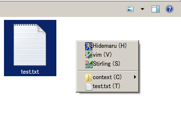
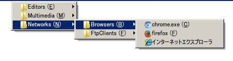

概要
=========================
lpopupとは
-------------------------
lpopupはLua言語でカスタマイズ可能な、汎用ポップアップメニューツールです。デフォルトでは以下のサンプルが含まれています。

- ポチエスのような、拡張子別で実行プログラムを選択するツール

- ポップアップ型ランチャー

基本
-------------------------

設定ファイルの読み込み
~~~~~~~~~~~~~~~~~~~~~~~~~~~~~~
lpopupは実行ファイル+ ``.conf.lua`` という名前のファイルを設定ファイルとして読み込み、実行します。

- ``lpopup.exe`` の場合 ``lpopup.conf.lua``
- ``launcher.exe`` の場合 ``launcer.conf.lua``

プログラムの実行
~~~~~~~~~~~~~~~~~~~~~~~~~~~~~~
lpopupは読み込んだ設定ファイルの :lua:func:`lpopup_execute` 関数を実行します。詳細は :doc:`api` を参照してください。

デフォルトサンプルアプリの設定方法
-------------------------------------
拡張子別実行プログラムセレクタ
~~~~~~~~~~~~~~~~~~~~~~~~~~~~~~~~
まず、 ``ext_lpopup.conf.lua`` を ``lpopup.conf.lua`` としてコピーしてください。このファイルの設定内容は以下の通りです。

    .. code-block:: lua

        local const = lpopup.apps.ext_const
        lpopup.apps.ext(argv, {
          system = {
            -- 表示位置の設定(タイプ、x座標, y座標)
            -- SHOW_MOUSE : マウスカーソルの位置
            -- SHOW_COORD:  指定座標
            -- SHOW_WINDOW: アクティブウインドウの中央
            -- SHOW_CENTER: ウインドウの中央
            show = { 
              const.SHOW_MOUSE, 
              0, 
              0
            },

            -- アイコンを表示するか
            icon = true,

            -- メニュー表示順序
            -- ext: 拡張子別
            -- type: タイプ別(フォルダかファイルか)
            -- all: 共通
            order = {"ext", "type", "all"}
          },
          -- メニューアイテム定義
          items = {
            -- 共通メニュー
            [".*"] = {
              {"--------------"},
              {"context", const.NATIVE_CONTEXT_MENU, {icon=const.DIRICON}},
              {argv[1], function()
                lpopup.shell_execute([["]]..argv[1]..[["]])
              end, {icon=argv[1]}}
            },
            -- フォルダメニュー
            [".directory"] = {
              {"explorer", [[C:\Windows\explorer.exe "${1}"]]},
            },
            -- ファイルメニュー
            [".file"] = {
              {"notepad", [[c:\windows\system32\notepad.exe "${1}"]]},
            },
            -- 拡張子別メニュー: ｜区切りで複数書ける
            ["txt|bat"] = {
              {"notepad", [[c:\windows\system32\notepad.exe "${1}"]]},
              {"|"},
              {"notepads", {
                  {"notepad1", [[c:\windows\system32\notepad.exe "${1}"]]},
                  {"notepad2", [[c:\windows\system32\notepad.exe "${1}"]]},
              }}
            }
          }
        })

メニューアイテム定義は以下のいずれかです。

- ``{"---------------"}`` : 水平セパレータ
- ``"{"|"}`` : 垂直セパレータ
- ``{"表示名", "実行プログラム定義", {icon=アイコンファイル}``
    - 表示名: メニューに表示される表示名です。以下の特別な値があります。
        - ``const.BASENAME`` : ファイル名
    - 実行プログラム定義 : 実行するプログラム定義です。 ``${1}`` はファイルパスに置換されます。以下の特別な値があります。
        - ``const.NATIVE_CONTEXT_MENU`` : OSネイティブの右クリックメニューを表示します。
        - Lua関数 : 引数、戻り値ともに空の関数を実行します。
    - アイコンファイル : デフォルトでは実行プログラム定義から自動でアイコンを表示しますが、手動で指定したい場合、この値にアイコンのパスを入れてください。

ポップアップランチャー
~~~~~~~~~~~~~~~~~~~~~~~~~~~~~~~~~
まず、 ``launcher_lpopup.conf.lua`` を ``lpopup.conf.lua`` としてコピーしてください。このファイルの設定内容は以下の通りです。

    .. code-block:: lua

        local const = lpopup.apps.launcher_const
        lpopup.apps.launcher(argv, {
          -- ext_lpopup.conf.luaと同じです。
          system = {
            show = { 
              const.SHOW_MOUSE, 
              0, 
              0
            },
            icon = true,
          },

          -- ランチャーデータディレクトリ
          rootdir = [[data]]
        })

このランチャーは、 ``rootdir`` 配下のフォルダ構造とショートカットファイル( ``*.lnk`` ファイル)を読み込んでメニューを表示します。例えば以下のような構造にします。

    .. code::

        /
        |-  001_Editors
        |        |- vim.lnk
        |        |- notepad.lnk
        |        
        |-  002_Browsers
        |        |- firefox.lnk
        |        |- chrome.lnk

メニューは名前でソートされます。また先頭の ``001_`` のような数字＋＿は表示上は削除されます。ファイル名が ``_`` から始まるファイルは無視されます。

独自アプリ作成方法
------------------------

 :doc:`api` を参照してください。
